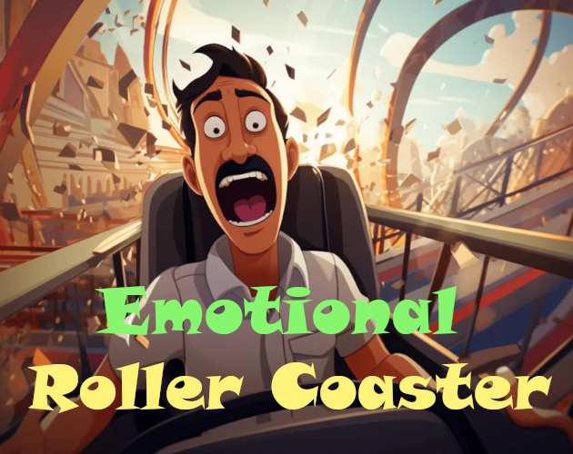
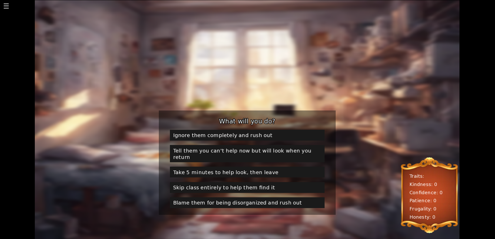
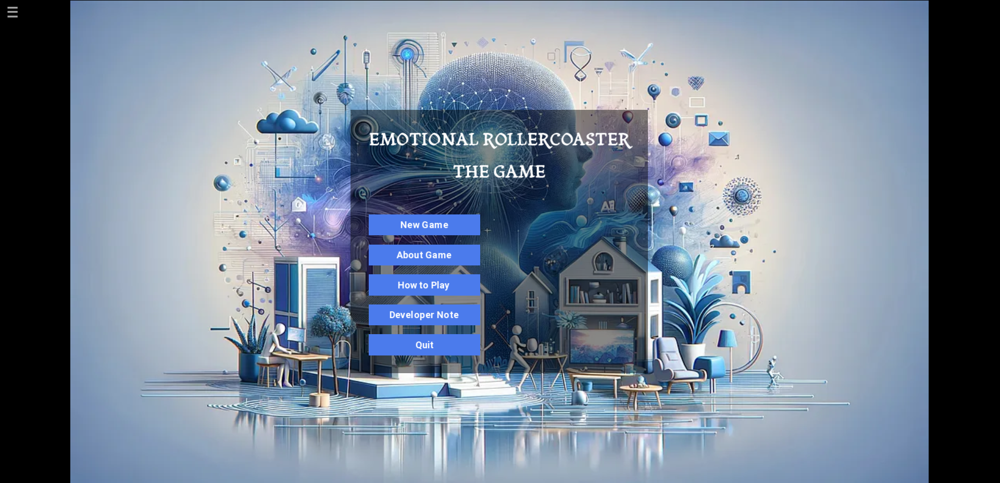
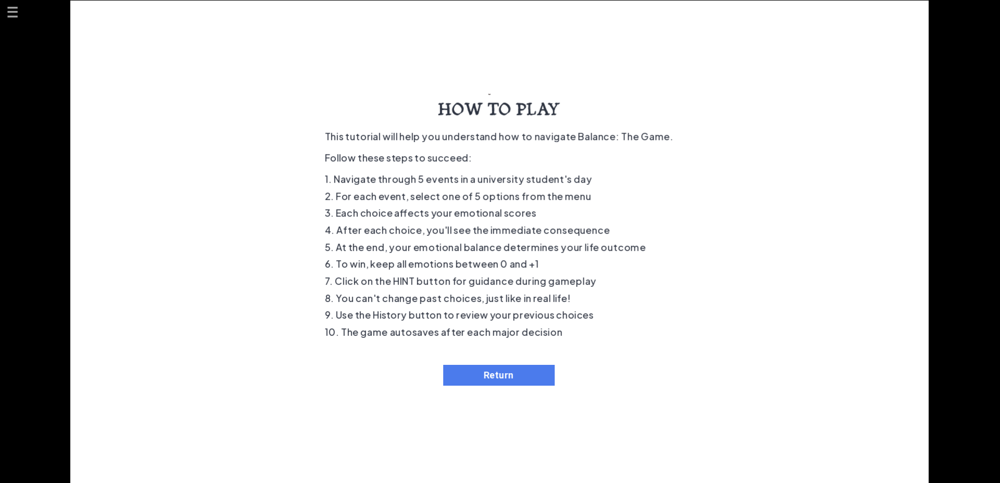

# Emotional Roller Coaster



## About the Game

"Emotional Roller Coaster" is a visual novel made with Ren'Py that explores the importance of emotional balance in life. You play as a university student navigating through daily events where every decision impacts your emotional state and life outcome. The key to winning is finding balance between extremes - neither too kind nor too cruel, neither too happy nor too sad.

## Table of Contents

- [Game Overview](#game-overview)
- [Installation Guide](#installation)
- [Installing Ren'Py](#installing-renpy)
- [Running the Game](#running-the-game)
- [Screenshots](#screenshots)
- [File Structure](#file-structure)
- [Development Mode](#development-mode)
- [Editing the Game](#editing-the-game)
- [Contributing](#contributing)
- [License](#license)
- [Recovering Game Files](#recovering-game-files)

## Game Overview

"Emotional Roller Coaster" challenges players to navigate a day in the life of a university student while maintaining emotional balance. Each decision affects emotional stats, with the goal being to find the middle path between extremes.

For detailed game mechanics, controls and documentation, see [renpy.md](renpy.md).

## Installation Guide

### System Requirements

- Windows 7+ / macOS 10.10+ / Linux
- 2GB RAM
- 70MB free disk space
- 1280x720 screen resolution or higher

### Download & Installation

<!-- #### Option 1: Direct Download
1. Download the game package from [releases page](https://github.com/yourusername/emotional-roller-coaster/releases)
2. Extract the ZIP file to your preferred location
3. Run the appropriate file for your system:
   - Windows: `EmotionalRollerCoaster.exe`
   - macOS: `EmotionalRollerCoaster.app`
   - Linux: `EmotionalRollerCoaster.sh`
 -->
#### Option 1: Clone from GitHub
1. Install [Git](https://git-scm.com/downloads) if you don't have it
2. Open a terminal/command prompt
3. Run: `git clone https://github.com/yourusername/emotional-roller-coaster.git`
4. Navigate to the game directory: `cd emotional-roller-coaster`
5. Install Ren'Py SDK from [renpy.org](https://www.renpy.org/latest.html)
6. Open the project with Ren'Py launcher and click "Launch Project"

#### Option 2: Download Zip file containing game source from github

1. Go to the repository which is this you are in[Emotional-roller-coaster](https://github.com/Mavros-Lykos/Emotional-Roller-Coaster-gamedevjs-2025)
2. Go to ' <> Code ' section in the repository which is in green color and click and open. 
3. In the local panel at the end there is 'Download zip'
4. Download it and decompress it.
5. Install Ren'Py SDK from [renpy.org](https://www.renpy.org/latest.html)
6. Open the project with Ren'Py launcher and click "Launch Project"


## Installing Ren'Py

To run or edit the game in development mode, you need to install the Ren'Py SDK:

1. Visit [Ren'Py's download page](https://www.renpy.org/latest.html)
2. Download the appropriate version for your operating system
3. Install/extract Ren'Py:
   - **Windows**: Run the installer or extract the ZIP file
   - **macOS**: Mount the DMG file and drag the Ren'Py app to your Applications folder
   - **Linux**: Extract the tarball to a location of your choice

For more detailed instructions, see the [official Ren'Py documentation](https://www.renpy.org/doc/html/quickstart.html).

## Running the Game

<!-- ### Release Version

Simply double-click the executable file for your platform:
- Windows: `EmotionalRollerCoaster.exe`
- macOS: `EmotionalRollerCoaster.app`
- Linux: `EmotionalRollerCoaster.sh` -->

### In Ren'Py Launcher

1. Open the Ren'Py Launcher
2. Click "Add Existing Project"
3. Navigate to and select the game directory
4. Once added, select "Emotional Roller Coaster" from the project list
5. Click "Launch Project" to start the game

## Screenshots


*The protagonist making a critical decision during the morning event*


*game window*

*game window*


## File Structure

```
emotional-roller-coaster/
├── game/
│   ├── cache/             # Generated cache files
│   ├── images/            # Game images and assets
│   ├── gui/               # UI elements and themes
│   ├── saves/             # Player save files
│   ├── audio/             # Music and sound effects
│   ├── tl/                # Translations
│   ├── script.rpy         # Main game script
│   ├── options.rpy        # Game settings
│   ├── screens.rpy        # UI screens definition
│   |── styles.rpy         # Styles for the game components
│   ├── screens.rpy        # UI screens definition
│   └── styles.rpy         # Styles for the game components
├── assets/                # External assets (screenshots etc.)
│   ├── cover.png          # Game cover image
│   └── screenshots/       # Game screenshots
├── LICENSE                # MIT License file
├── README.md              # Project information
├── renpy.md              # Project information

```

## Development Mode

To run the game in development mode:

1. Install Ren'Py as described [above](#installing-renpy)
2. Open the Ren'Py Launcher
3. Add the game as a project (if not already added)
4. Select "Emotional Roller Coaster" from the project list
5. Click "Launch Project" to run the current version
6. For development tools, click on "Developer" in the Ren'Py Launcher for options like:
   - "Developer Tools" for console access
   - "Theme Test" to test UI themes
   - "Image Location Picker" for positioning elements

Additional developer options are available in the "preferences" menu of the Ren'Py launcher.

## Editing the Game

### Basic Editing

1. From the Ren'Py Launcher, select the game and click "Open Project Directory"
2. Navigate to the `game` folder which contains all the script files
3. Edit the `.rpy` files using any text editor (we recommend [Visual Studio Code](https://code.visualstudio.com/) with the [Ren'Py Language](https://marketplace.visualstudio.com/items?itemName=LuqueDaniel.languague-renpy) extension)

### Key Files to Edit

- `script.rpy`: Main game script and story
- `options.rpy`: Game settings and configurations
- `screens.rpy`: UI screens definition
- `gui.rpy`: Visual styling of the game
- `styles.rpy`: Styling components in the game


### Adding Assets

- Place images in the `game/images/` directory
- Place audio files in the `game/audio/` directory
- Place custom fonts in the `game/fonts/` directory

For more detailed guidance on Ren'Py development, see:
- [Ren'Py Documentation](https://www.renpy.org/doc/html/)
- [Ren'Py Cookbook](https://lemmasoft.renai.us/forums/viewforum.php?f=51)

## Contributing

We welcome contributions to Emotional Roller Coaster! Please see [CONTRIBUTING.md](CONTRIBUTING.md) for guidelines on how to contribute to the project.


## License

This game is licensed under the MIT License - see the [LICENSE](LICENSE.md) file for details.

## Recovering Game Files

If you accidentally delete any `.rpy` script files, you can recover them from the compiled `.rpyc` files using the [unrpyc](https://github.com/CensoredUsername/unrpyc) tool. See the [recovery guide](renpy.md#recovering-deleted-rpy-files) for detailed instructions.

---

Created for the [GameDevJS GitHub Challenge](https://gamedevjs.com/challenge/)